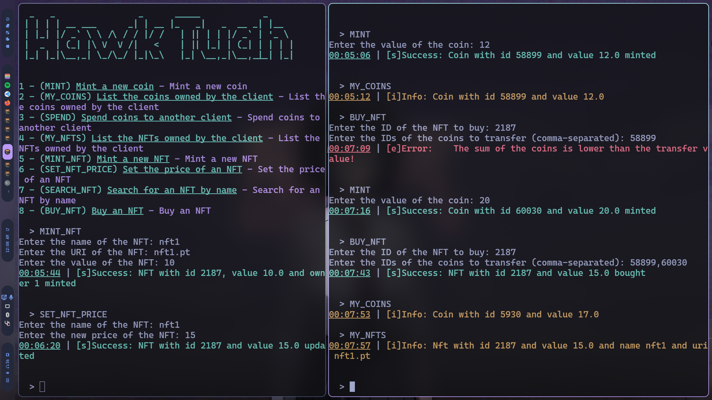

# BFT-SMaRt Decentralized Token Infrastructure

## Authors

- André Reis - fc58192
- Daniel Nunes - fc58257
- Gonçalo Pinto - fc58178

Faculdade: https://ciencias.ulisboa.pt/

## Project overview

The project is a deterministic wallet-like service that manages coins based on the UTXO (Unspent Transaction Output) model introduced in Bitcoin and NFTs (Non-Fungible Tokens) that can be transacted using the coins. In this model, each object (coin) represents a certain amount of currency a user possesses. This means a transaction consumes a given number of input objects to produce one or two output objects.

### Project Preview



In the picture, there is an example of the project in runtime.

## Project Description

The system keeps track of two types of tokens and their ownership. These tokens contain the following information:

### Coin
- **ID**: an integer (int) with the coin ID (no two coins can have the same id)
- **Owner**: an integer (int) with the id of the client owning the coin
- **Value**: a real number (float) with the value of the coin

### NFT
- **ID**: an integer (int) with the NFT id (no two NFTs can have the same id)
- **Owner**: an integer (int) with the id of the client owning the NFT
- **Name**: the name (a String) of the NFT
- **URI**: the URI (a String, typically a URL) of the NFT
- **Value**: a real number (float) with the value of the NFT

## Operations

### Coin-related Operations
- **MY_COINS()**: Get the IDs and values of the coins associated with this user.
- **MINT(value)**: Require the value of the coin to create for the issuer. The issuer needs permission to execute this operation, as defined during system initialization. The operation returns the ID of the newly created coin.
- **SPEND(coins, receiver, value)**: Requires an array with the IDs of the coins that will be used as input, the ID of the user that will receive the transfer (receiver), and the value to be transferred. If the indicated coins provide enough funds to execute the transaction (sum(coins) >= value), the operation consumes the coins and generates two coins, one for the receiver with the value it received and another for the issuer (who invoked the operation) with the remaining value (sum(coins) - value). The operation returns either the ID of the coin created for the issuer with the remaining value, 0 in case no coin was created (due to no remaining), or -1 if the operation failed.

### NFT-related Operations
- **MY_NFTS()**: List the ID, name, URI, and value of the NFTs the issuer possesses.
- **MINT_NFT(name, uri, value)**: Create an NFT for the issuer with the name and uri specified. There cannot be two NFTs with the same name. Returns the id of the newly created NFT.
- **SET_NFT_PRICE(nft, value)**: Change the price of a given NFT owned by the issuer to a new value.
- **SEARCH_NFT(text)**: List the id, name, URI, and value of the NFTs whose name contains the provided text (ignores case).
- **BUY_NFT(nft, coins)**: Requires an array with the IDs of the coins that will be used as input and the ID of the NFT to be bought. If the indicated coins provide enough funds to execute the transaction (sum(coins) >= nft.value), the operation changes the NFT owner field to the buyer ID, deletes the provided coins, and generates two coins, one for the NFT owner with the value it received and another for the issuer (who invoked the operation) with the remaining value (sum(coins) - value). The operation returns either the ID of the coin created for the issuer with the remaining value, 0 in case no coin was created (due to no remain), or -1 if the operation failed.

## Getting Started

## Build the Project
To build the project, run the following command:
```sh
java -cp <classpath> ./gradlew installDist
```
To enable read-only operations, open the file ./config/system.config and change the option in the last line to true.

### Running the Server
To start the server, run the following command:
```sh
cd build/install/library && ./smartrun.sh bftsmart.intol.bftmap.BFTMapServer <server id>
```

### Running the Client
To start the client, run the following command:
```sh
cd build/install/library && ./smartrun.sh bftsmart.intol.bftmap.BFTMapInteractiveClient <server id>
```